# Debt Manager Web application
A secure and user-friendly debt management web application built with Express.js and Node.js utilizing the MVC pattern. This app allows users to track debts, manage payments, and monitor their financial records while ensuring data security through data encryption using BCrypt as well as, authentication and authorization mechanisms and SQL injection prevention.

Tech stack:

- NodeJS
- ExpressJS
- MySQL
- Embedded JavaScript
- HTML & CSS
- Bootstrap

## Features:
### UI/UX:
Optimizing user interactions with a clean, intuitive interface designed for effortless navigation. The application ensures users receive instant, clear feedback through flash messages after every action, keeping them informed about successes or errors. A modern, visually appealing design with soothing colors enhances the overall experience, making debt management seamless and stress-free. Additionally, built-in safeguards like password confirmation matching and the option to view passwords while entering them help prevent user errors and improve accessibility.

Image One - Example showing registeration page:

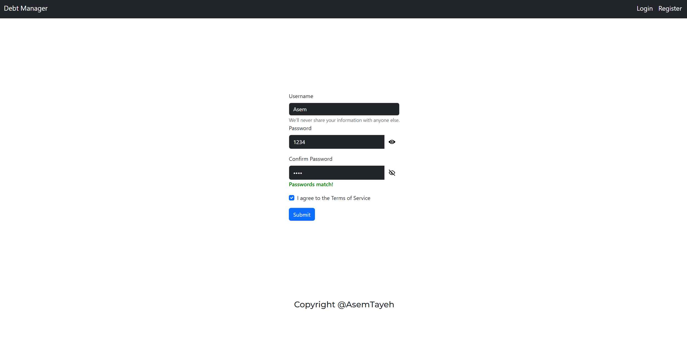

Image Two - Example showing flash message feedback after an unsuccessful registration:

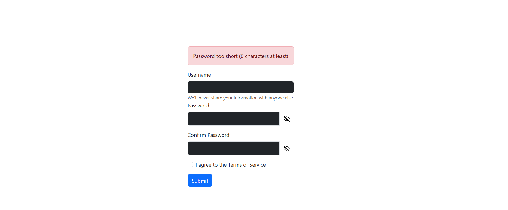

Image Three - Example showing user entering passwords that do not match:

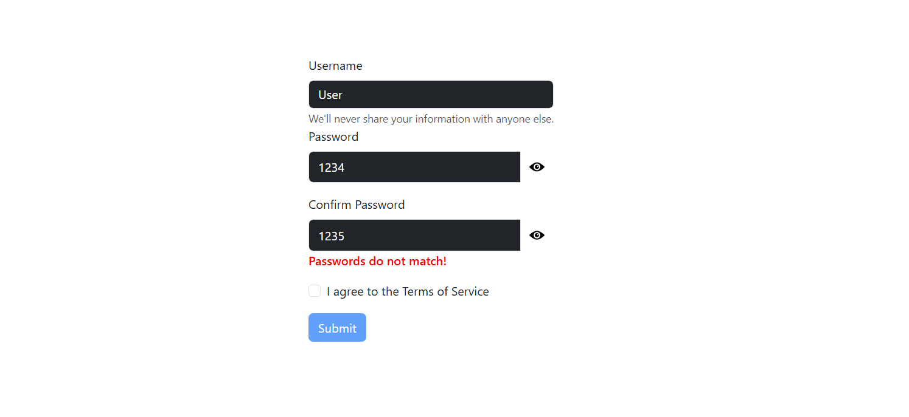

Image Four - Example showing the home page for a new user:

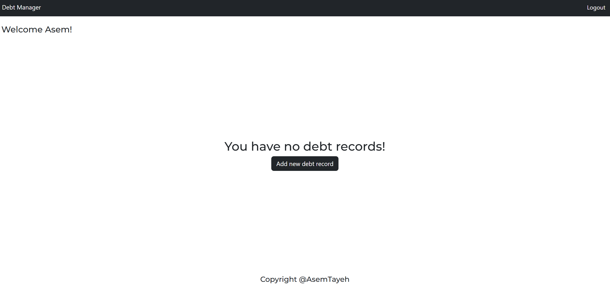

Image Five - Example showing the homepage for a returning user:

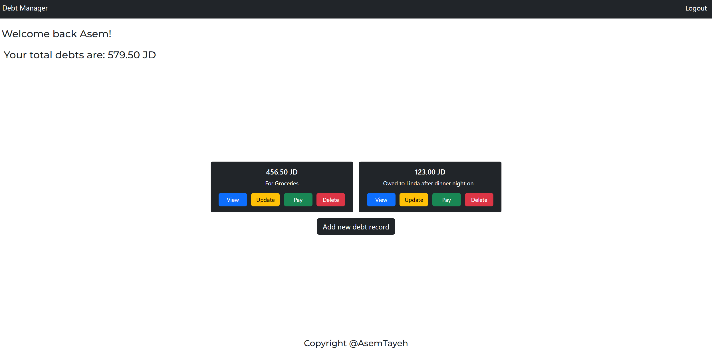

### Create debt records:
Users can create their debt records using the button "Add new debt record" that is displayed in the homepage.

Image six - Example of Add Debt Record button:

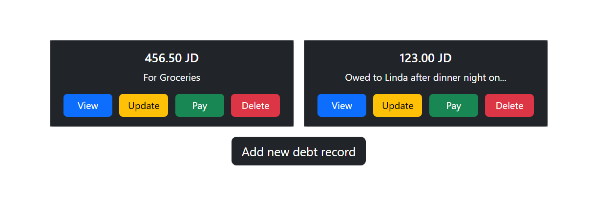

Image Seven - Example showing debt creation page:

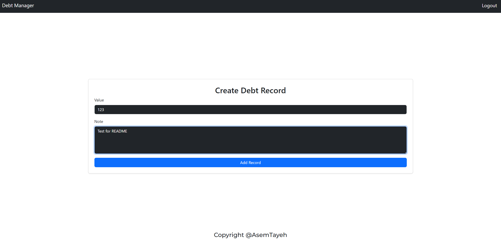

Upon a successful action the user is greeted with a flash message to verify their action.

Image Eight - Example of flash message after record creation:

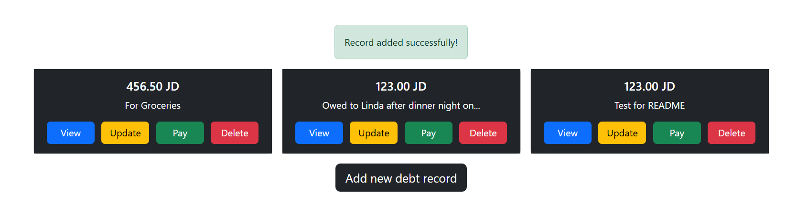

### View debt records:
After creating a debt record, notes exceeding 35 characters are automatically truncated with "..." for a cleaner display. To view the full note, users can simply click the "View" button, which seamlessly redirects them to the detailed view page for a complete and clear presentation.

Image Nine - Example of view page:

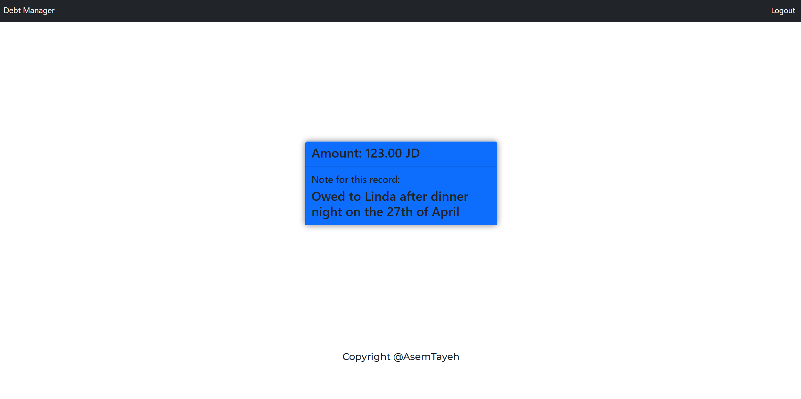

### Update debt record: 
Users can update any given debt record, after updating a debt record, a flash message is displayed to confirm whether the update was successful or if an error occurred. This ensures users receive immediate feedback, keeping the experience smooth and intuitive while managing their debts.

Image Ten - Example showing Update page:

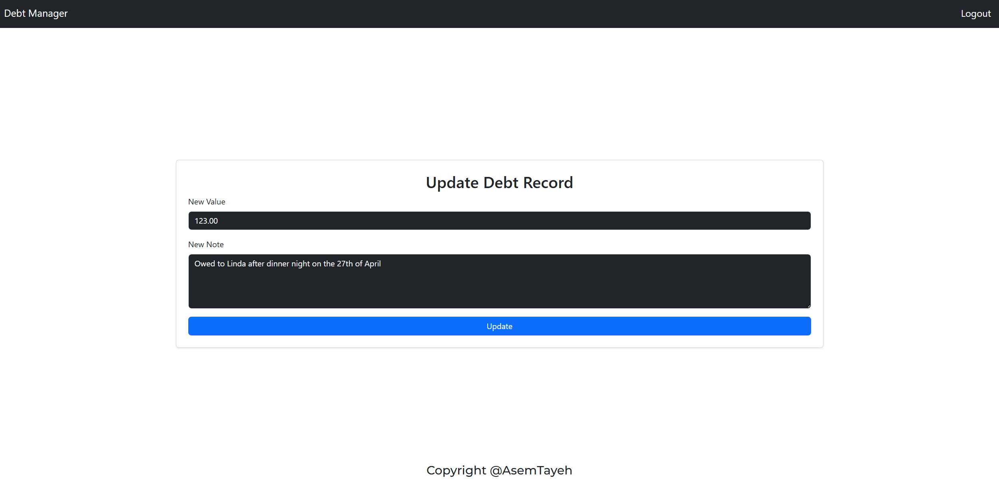

### Pay off debt record:
Users can pay off any given debt record, paid off debt records are then removed from the total debts displayed on the home page and are marked as paid on the home page with the pay button subsequently removed:

Image Eleven - Example showing a paid off record:

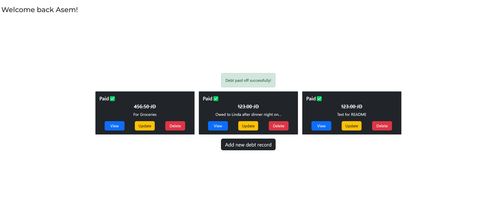

### Delete debt record:
Users can delete any given debt record simply by pressing the "Delete" button on any given debt record

Image Twelve - Example showing pop-up to confirm deletion of a record:

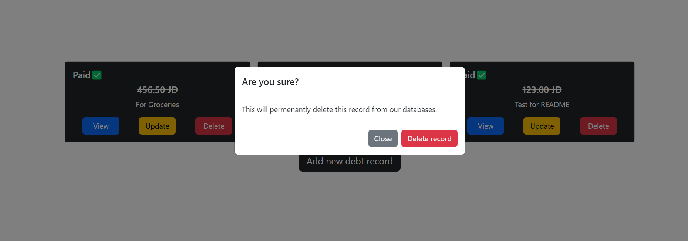

### Security:
This application prioritizes security at every level. It implements robust authentication using session management, with a secret key securely stored in an environment variable. Authorization mechanisms ensure users can only access their own information and debt records, preventing unauthorized access to sensitive data. To safeguard against SQL injection vulnerabilities, we utilize the mysql2 library, which offers strong protection against such attacks. User passwords are never stored in plain text—only securely hashed passwords are stored, leveraging the BCrypt hashing algorithm. Furthermore, every user transaction is authenticated and authorized to ensure that actions are legitimate and comply with access controls.